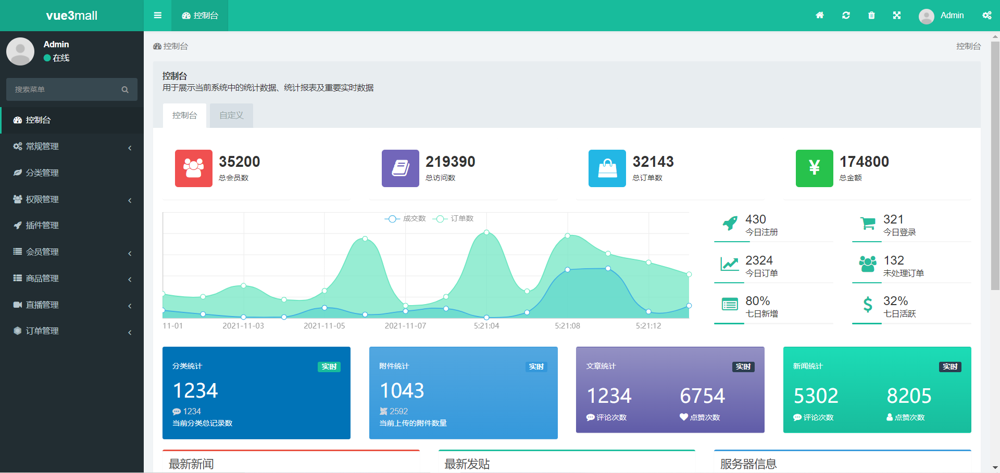

# vue3-mall-api 基于ThinkPHP6框架开发 

## **vue3-mall-page 项目地址(本项目的前端项目)**
https://github.com/maxzyt/vue3-mall-page

## **vue3-mall-api功能说明**
* 基础设置：网站配置
* 会员管理：会员列表，收藏记录，浏览历史，收货地址
* 商品管理：商品分类，商品添加修改
* 直播管理：直播分类，直播设置
* 订单管理：订单列表

## **项目截图**

## **问题反馈**

在使用中有任何问题，请使用以下联系方式联系我们

QQ: 1004991278

Email: 1004991278@qq.com

## **感谢**
[ThinkPHP](http://www.thinkphp.cn/)

[YFCMF-TP6](https://www.iuok.cn/)